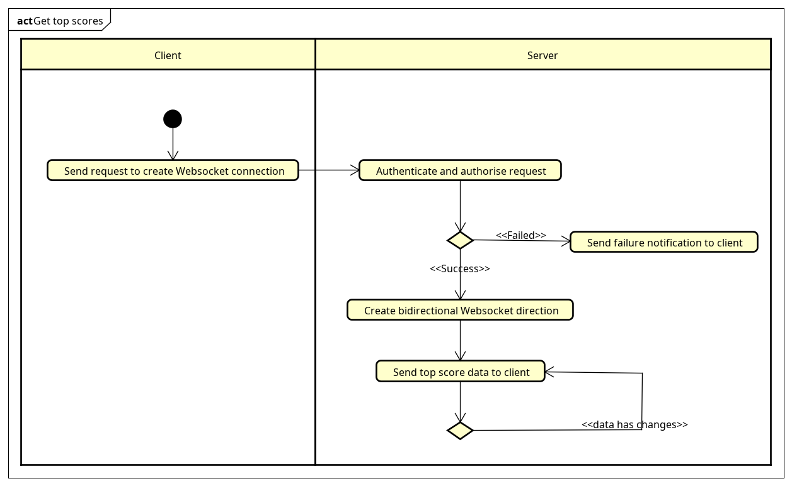
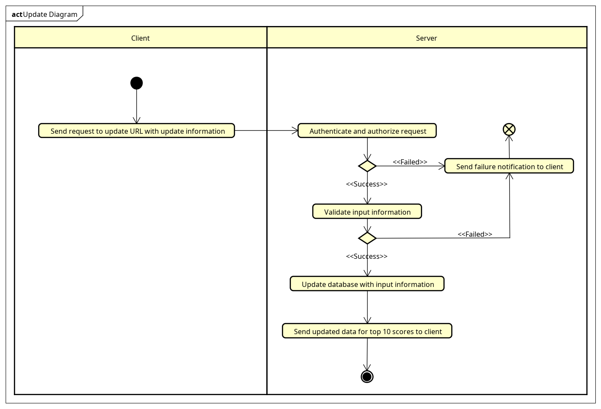

# Score Board API Service

## Overview

This module provides an API service for managing the score board of a website. It allows for live updates of the top 10 user scores and ensures that only authorized actions can increase a user's score.

## Endpoints

### Get live update Top 10 Scores using Websocket Endpoint

- **URL**: `/api/live-update`
- **Method**: GET (WebSocket)
- **Description**: Establishes a WebSocket connection to receive live updated data.
- **Authorization:** Requires authentication token in the request headers.

#### Server-Side Logic

**WebSocket Connection Handling**:

- Listen for incoming WebSocket connections on the `/api/live-update` endpoint.
- Upon connection, authenticate the client if necessary and maintain the WebSocket connection.
- Manage WebSocket connections, including tracking connected clients and handling disconnections.

**Data Update Logic:**
Implement logic to generate or retrieve the live updated data.
When new data is available or updated, send a message containing the updated data to all connected clients over their respective WebSocket connections.

#### Client-Side Logic

- **Establish WebSocket Connection:**

  - The client establishes a WebSocket connection by connecting to the `/api/live-update` WebSocket endpoint.
  - Upon successful connection, the client listens for incoming messages from the server.

- **Receive Data Updates:**

  - When the server sends a message containing updated data over the WebSocket connection, the client receives the message.
  - The client processes the received data and updates the UI accordingly to reflect the changes in real-time.

#### Authentication and Authorization:

- Implement authentication and authorization mechanisms to ensure that only authorized clients can establish WebSocket connections and receive live updated data.
- Authorize clients based on their permissions or roles to access the live updated data.

### Update Score

- **URL:** /api/score/update
- **Method:** POST
- **Description:** Updates the score of a user upon completion of an action.
- **Authorization:** Requires authentication token in the request headers.
- **Request Body:**
  - `userId` (required): The ID of the user whose score needs to be updated.
  - `actionId` (required): The ID of the action completed by the user.
- **Response:**

  - `status` (string): Indicates the status of the score update. Possible values: success or failed.
  - `message` (string): Provides additional information about the result of the score update.

- **Security Considerations**
  - **Authentication**: Ensure that the request is authenticated using a valid access token in the request headers (Authorization: `Bearer <authentication_token>`).
  - **Authorization**: Validate the user's authorization to update scores before processing the request.
  - **Error Handling**: Implement robust error handling to provide informative error messages and prevent potential security vulnerabilities.
  - **Input Validation**: Validate and sanitize the request body to prevent injection attacks and ensure data integrity.
  - **Rate Limiting**: Implement rate limiting to prevent abuse and protect against denial-of-service attacks.

## Future Improvement

### Scalability and Performance

#### Load Balancing:

- Use load balancing techniques to distribute WebSocket connections across multiple server instances for scalability and high availability.
- Employ WebSocket-aware load balancers or proxy servers to efficiently handle WebSocket traffic.

#### Optimized Data Transfer:

- Optimize data transfer over WebSocket connections to minimize latency and bandwidth usage.
- Use efficient serialization formats (e.g., JSON) and consider data compression techniques to reduce data size for transmission.

#### Monitoring

- Implement monitoring solutions to track WebSocket connection status, data transfer rates, and server performance metrics.
- Use monitoring tools and dashboards to monitor WebSocket server health and diagnose issues in real-time.
